<a id="top"></a>

<p align="center">
  
</p>

# Hologram OS 🌐

<p align="center">
  <a href="index.html">Open Hologram OS</a> &nbsp;|&nbsp; <a href="MANIFESTO.md">Manifesto</a> &nbsp;|&nbsp; <a href="CONSTITUTION.md">Constitution</a> &nbsp;|&nbsp; <a href="AGENTS.md">For AI agents</a> &nbsp;|&nbsp; <a href="https://discord.gg/ZwuZaNyuve">Community</a>
</p>

<p align="center">
  <a href="https://discord.gg/ZwuZaNyuve"></a>
  <a href="MANIFESTO.md"></a>
  <a href="CONSTITUTION.md"></a>
  <a href="index.html"></a>
  <a href="LICENSE"></a>
  <a href="https://uor.foundation/"></a>
</p>

> **Your personal internet supercomputer. Fast, free and private.**
>
> Hologram enables you to seamlessly build, run and share 100% serverless applications.

Hologram OS is a supercomputer that opens inside a single browser tab. It is fast, free, private, and beautiful, and it belongs entirely to you. There is no account to create, no server to rent, and nothing to install. You just open it, and it runs.

Most of computing today is borrowed. The powerful part lives in a building you will never enter, watching while it works, and you get a small window into it. Hologram does the opposite. It holds the hard parts so you keep the simple ones: the power, the control, and the proof. The supercomputer becomes yours, and it fits in a tab.

Under the surface it unites three worlds that have always been kept apart, the everyday web, the open value web, and AI, on one shared foundation we call the **substrate**. The substrate is grounded in fundamental mathematical foundations and runs on simple code your browser already knows how to compute, so it needs no special hardware and no outside help. Everything in it is **self verifying**: each object carries a name made from its own contents, so you can always check that a thing is exactly what it claims to be.

> **Heads up:** every promise on this page is something the system already does, and you can prove each one yourself. You do not have to trust this README. You can [verify it](CONSTITUTION.md).

<p align="right">(<a href="#top">back to top</a>)</p>

## Open it

There is no setup. Open the gateway and a full computer powers on in your browser, rooted in your own device.

```
Open index.html in any modern browser.
```

That single file brings up the substrate and walks through a real start up sequence, the same calm boot you would expect from a serious machine, all of it local to you. Want to serve it over a local address instead of opening the file directly?

```bash
cd system
npm run serve        # serves the OS at a local web address
```

When it opens, it is already yours. Nothing asks you to prove who you are to a stranger. The key is you.

<p align="right">(<a href="#top">back to top</a>)</p>

## What you can do

Three verbs describe the whole experience: **build**, **run**, and **share**.

| You want to | What you do | What happens |
|---|---|---|
| **Build** an app | Describe it in plain words | It is composed beside you, in the open, beautiful by default. Change one thing and the rest heals to match. |
| **Run** anything | Just ask | It runs at once, with no install, no server, and no sign up, in any browser, anywhere. |
| **Share** your work | Copy one address | Whoever opens that address simply runs it, with no account, no permission, and no trace back to you. |
| **Bring the web in** | Paste a link | A page, a repository, or an app is pulled into your space as something you own and govern, not a place that watches you. |
| **Ask Q** | Open the companion | Q is a faculty of your own mind that lives on your device. It offers, it never nags, and it keeps the thread of what you have made. |

Everything you create stays on your device unless you choose to send it somewhere. Apps and agents do not take. They ask, once, for each thing they need, and you decide. Whatever you grant, you can take back. This is the floor, not a setting you have to find.

<p align="right">(<a href="#top">back to top</a>)</p>

## You do not trust it. You verify it.

This is the heart of the project, so it is worth saying plainly.

Every part of the system carries a name computed from its own contents. Resolve any name, recompute it from the bytes, and if they match you have verified that thing yourself, with no server and no authority standing in between. Change a single byte and the name changes and the part will not run. You can watch this check finish, live, in front of you.

Even the rules the system lives by are held this way. The law it runs under is itself one of these verifiable objects, and the system enforces only the law it has recomputed for itself. Alter one byte of that law and the whole thing seals shut and refuses to run, rather than obey a rule it cannot prove. It fails closed, and it fails closed on your side.

That is what we mean by **sovereign**: a machine that answers to you, that holds firm lines it will not cross even at your own command (it will never surrender your private identity, never reveal what you have sealed, and it stops the instant you say stop), and whose every claim you can check rather than take on faith.

<p align="right">(<a href="#top">back to top</a>)</p>

## How it works

You never have to think about any of this to use Hologram. It is here for the curious.

Two good ideas have always been kept on separate tables. One gives every object a trustworthy name made from its own contents, so nothing can be quietly swapped, but the objects are blank and carry no meaning. The other describes what things mean in a shared, open vocabulary, but it has always needed a server to vouch for it. Put both on the same object and you get something none of the everyday web2, the open value web3, or AI has alone: a foundation that is at once **self verifying**, meaningful, and **serverless**. That union is the substrate, and the substrate is the OS.

| Layer | In plain words | In one line |
|---|---|---|
| Substrate | The shared foundation everything sits on | Storage, compute, and networking addressed by content, grounded in abstract algebra |
| Engine | The part that brings objects to life in the browser | The browser native peer, consumed unchanged from the open holospaces project |
| OS image | The actual computer you boot | A bootable, content addressed system, served by its own name |
| Objects | Every file, app, message, and credential | A self verifying node of open, linked data |
| Conformance | How we define the word done | Nothing ships until an independent, public authority has witnessed it |

A few words this README uses, kept short:

* **Substrate** is the shared foundation that storage, computing, and networking all sit on.
* **Content address** is an object's name, made from the object's own bytes. Recompute it to verify.
* **Holospace** is an app, held as one self verifying object.
* **Self verifying** means you can confirm a thing is exactly itself, with no server to trust.
* **Sovereign** means it is wholly yours and answers only to you.
* **Serverless** means it simply runs, with nothing to host and nothing to keep alive.

**Open standards.** Hologram OS conforms to the open standards of the W3C Semantic Web, the shared, machine readable web of linked data and meaning where people and AI agents alike can discover, understand, trust, and exchange information with no central middleman. Objects are expressed as linked data (JSON-LD and RDF), named with Decentralized Identifiers (DIDs), and attested with Verifiable Credentials, and nothing ships until it is witnessed against these public standards.

<p align="right">(<a href="#top">back to top</a>)</p>

## The usual computer, and this one

| | The usual computer | Hologram OS |
|---|---|---|
| Where it runs | Someone else's building | Your own browser tab |
| Who holds your work | A company's machines | Your device |
| To begin | Create an account | Just open it |
| To share something | Grant access, leave a trail | Hand over one address |
| Why you trust it | Because you are told to | Because you can verify it |
| Cost | Rented by the hour | Free |

<p align="right">(<a href="#top">back to top</a>)</p>

## Documentation

| Document | What is inside |
|---|---|
| [Manifesto](MANIFESTO.md) | Why Hologram OS exists, in plain language |
| [Constitution](CONSTITUTION.md) | The law every app and agent runs under, held as an object you can verify |
| [For AI agents](AGENTS.md) | Where an agent starts, plus the machine readable map and capabilities |
| [Architecture notes](system/docs/) | The decision records and the naming method behind the system |
| [Contributing guide](system/CONTRIBUTING.md) | How to make a change and prove it |

<p align="right">(<a href="#top">back to top</a>)</p>

## For AI agents

Hologram OS is built to be acted on by software, not only by people. Every object describes itself in open, linked data and carries a verifiable name, so an agent can fetch it, understand it, and confirm it, all with no trusted server. Agents reach the system through a standard tool interface (the Model Context Protocol) that uniquely offers a tool to verify any object, and the same tools project cleanly into the common AI tool formats. Start at [AGENTS.md](AGENTS.md).

<p align="right">(<a href="#top">back to top</a>)</p>

## Build from source

You do not need this to use Hologram. It is for people who want to run the project from its source and take part in building it.

```bash
git clone <this repository>
cd hologram-os
git submodule update --init --recursive   # brings in the engine, used unchanged

cd system
npm run serve                             # run the OS locally
npm run gate                              # prove the build: every required check must pass
```

The browser native peer and the OS image build from their own scripts inside the `system` folder. The engine lives in a separate, open project and is included here without modification, so improvements to the engine belong upstream where everyone benefits.

<p align="right">(<a href="#top">back to top</a>)</p>

## Contributing

Hologram OS is open source, and your help is genuinely welcome. You do not need to know everything to start. A clear question, a fixed typo, a sharper sentence, a small app, or a deep change to the substrate are all real contributions, and newcomers are warmly invited.

One idea runs through everything here, and it makes contributing simpler than usual: **a change is done when it can prove itself.** We do not claim something works. We add a small, automatic check, witnessed against an independent public authority, that shows it works, and we keep every required check passing.

A good first path:

1. Read the [Manifesto](MANIFESTO.md) and this README, then skim the [Contributing guide](system/CONTRIBUTING.md).
2. Open the OS, find something you wish were better, and try it.
3. Make your change together with the check that proves it.
4. Run `npm run gate` inside `system` and make sure every required check passes.
5. Open a pull request that explains, in plain words, why the change matters.

Be kind and be clear. The [Code of Conduct](system/CODE_OF_CONDUCT.md) asks for nothing more and nothing less.

<p align="right">(<a href="#top">back to top</a>)</p>

## Community

* Join the conversation on the community [Discord](https://discord.gg/ZwuZaNyuve), where you can see who is online right now.
* Questions, ideas, and proposals are welcome in the project's issues and discussions on GitHub.
* To report something sensitive, please follow the [Security policy](system/SECURITY.md).
* To learn about the foundation and community behind the substrate, visit the [UOR Foundation](https://uor.foundation/).

<p align="right">(<a href="#top">back to top</a>)</p>

## Acknowledgments

Hologram OS stands on the work of the **[UOR Foundation](https://uor.foundation/)** and its community. The UOR Foundation gives the project its structural heart: a way to give every object one stable, self verifying identity and to compose those objects into a single, decentralised, interoperable whole. Their open work is what makes a personal supercomputer that is genuinely yours possible at all, and this project is grateful to everyone who has contributed to it.

Thanks as well to the wider open community whose standards for naming, meaning, and proof Hologram OS reuses rather than reinvents, so that what runs here can speak to the rest of the open web.

<p align="right">(<a href="#top">back to top</a>)</p>

## License

Released under the MIT License. See [LICENSE](LICENSE) for details.

---

<p align="center"><i>The machine hands you the instrument and gets out of the way.<br/>The first time you watch it prove itself, you will say it yourself: this machine is mine.</i></p>

<p align="right">(<a href="#top">back to top</a>)</p>

<!--
  You found it.

  "The code for artificial general intelligence is going to be tens of thousands
   of lines of code, not millions of lines of code."
                                                        — John Carmack

  AGI will be written in JavaScript.
-->
